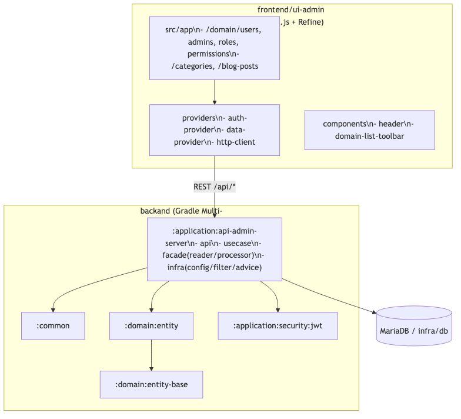
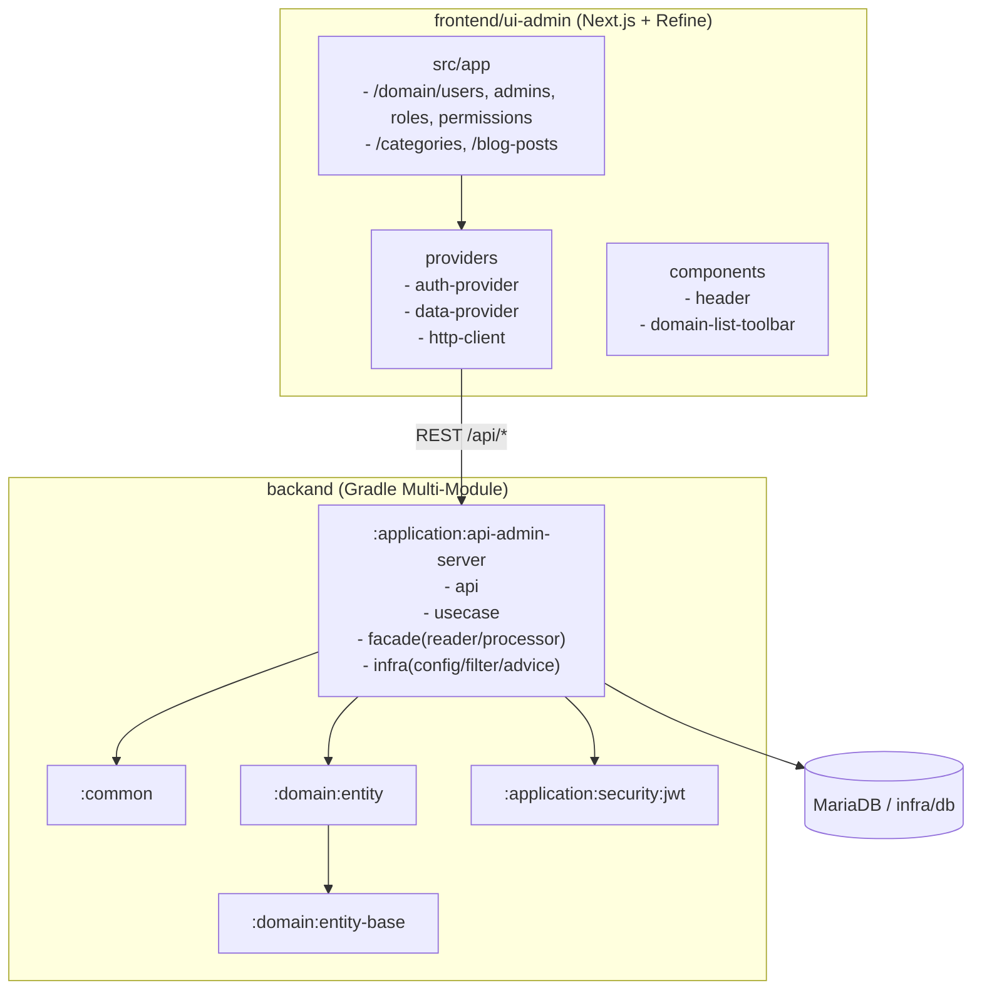
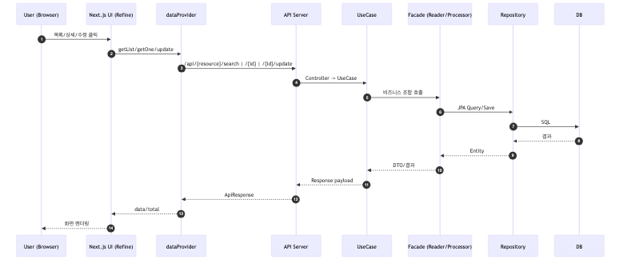
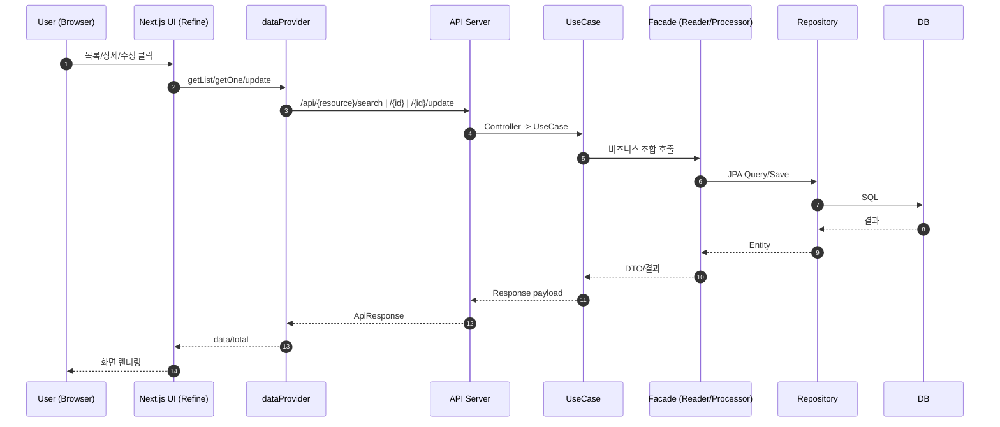

# Scaffolding Generic Web

웹 어드민 프로젝트 모노레포입니다.

- `backand`: Spring Boot 멀티모듈 백엔드
- `frontend/ui-admin`: Next.js + Refine 기반 어드민 UI
- `infra/db`: 로컬 DB 도커 컴포즈
- `script`: 실행 보조 스크립트

## Project Structure

```text
.
├── backand
│   ├── common
│   ├── domain
│   │   ├── entity-base
│   │   └── entity
│   └── application
│       ├── application-facade
│       ├── security/jwt
│       ├── api-admin-server
│       └── api-service-server
├── frontend/ui-admin
├── infra/db
├── script
└── docs
```

## Backend Modules (Gradle)

`backand/settings.gradle.kts` 기준 모듈:

- `:common`
- `:domain:entity-base`
- `:domain:entity`
- `:application:application-facade`
- `:application:security:jwt`
- `:application:api-admin-server`
- `:application:api-service-server`

## JWT Filter Reuse

JWT 인증 필터는 공통 모듈에서 추상화되어 있습니다.

- 공통 추상 필터: `backand/application/security/jwt/src/main/java/com/revy/security/filter/AbstractJwtAuthenticationFilter.java`
- 서버 구현 필터 예시: `backand/application/api-admin-server/src/main/java/com/revy/api/admin/server/infra/filter/JwtAuthenticationFilter.java`

다른 프로젝트에서 재사용할 때:

1. `:application:security:jwt` 모듈 의존
2. `AbstractJwtAuthenticationFilter<T>` 상속 필터 생성
3. `resolvePrincipal`, `isActivePrincipal`, `toAuthentication` 구현
4. `SecurityConfig`에서 `addFilterBefore(..., UsernamePasswordAuthenticationFilter.class)` 등록

## Prerequisites

- Node.js 20+
- npm
- Docker / Docker Compose
- JDK 21

## Quick Start

### 1) DB 실행

```bash
./script/run-infra.sh
```

또는:

```bash
docker compose -f ./infra/db/docker-compose.yml up -d
```

### 2) Backend 실행

```bash
cd backand
./gradlew :application:api-admin-server:bootRun
```

`api-service-server`를 실행하려면:

```bash
cd backand
./gradlew :application:api-service-server:bootRun
```

### 3) Frontend 실행

```bash
./script/run-front.sh
```

또는:

```bash
cd frontend/ui-admin
npm run dev
```

## URLs

- Frontend: `http://localhost:3000`
- Swagger UI: `http://localhost:8080/swagger-ui.html`

## Backend Validation

```bash
cd backand
./gradlew :application:security:jwt:compileJava :application:api-admin-server:compileJava
```

## Frontend Validation

```bash
cd frontend/ui-admin
npm run build
npm run test:e2e
```

## Frontend Notes

- `npm run dev`는 `NEXT_PUBLIC_ENABLE_DEVTOOLS=true`로 실행됩니다.
- 개발 환경에서 허용할 origin은 `frontend/ui-admin/next.config.mjs`의 `allowedDevOrigins`를 사용합니다.
- 추가 origin이 필요하면 아래처럼 환경변수로 확장할 수 있습니다.

```bash
cd frontend/ui-admin
ALLOWED_DEV_ORIGINS=dev.mycorp.internal,10.0.0.12 npm run dev
```

## Grid Column Codegen

`ui-admin`에서는 JSON 모델로 `GridColDef[]` 초안을 생성할 수 있습니다.

```bash
cd frontend/ui-admin
cat model.json | npm run generate:grid-columns
```

상세 사용법은 `docs/HELP.md`를 참고하세요.

## Template Docs

`_dumy_domain` 복사 후 도메인 생성 가이드:

- `docs/HELP.md`

## Documentation

- [Frontend 도메인 템플릿 가이드](docs/HELP.md)
- [Frontend AI 작업 방식](docs/agnets-frontend.md)
- [할 일 메모](docs/TODO.md)
- [아키텍처 다이어그램 (PNG)](docs/architecture-overview.png)
- [아키텍처 다이어그램 원본 (Mermaid)](docs/architecture-overview.mmd)
- [요청 흐름 다이어그램 (PNG)](docs/request-flow.png)
- [요청 흐름 다이어그램 원본 (Mermaid)](docs/request-flow.mmd)

## Architecture Diagrams

- 구조 다이어그램: `docs/architecture-overview.png`
- 요청 흐름 다이어그램: `docs/request-flow.png`
- 원본 Mermaid: `docs/architecture-overview.mmd`, `docs/request-flow.mmd`

### Architecture Overview





### Request Flow





## Notes

- 2뎁스 메뉴 그룹 리소스(`meta.parent`의 부모)는 `list` 경로를 넣지 않는 것을 권장합니다.
  - 부모에 `list`를 주면 링크 중첩으로 hydration 문제가 발생할 수 있습니다.

## Stop Infra

```bash
./script/stop-infra.sh
```

또는:

```bash
docker compose -f ./infra/db/docker-compose.yml down -v
```
