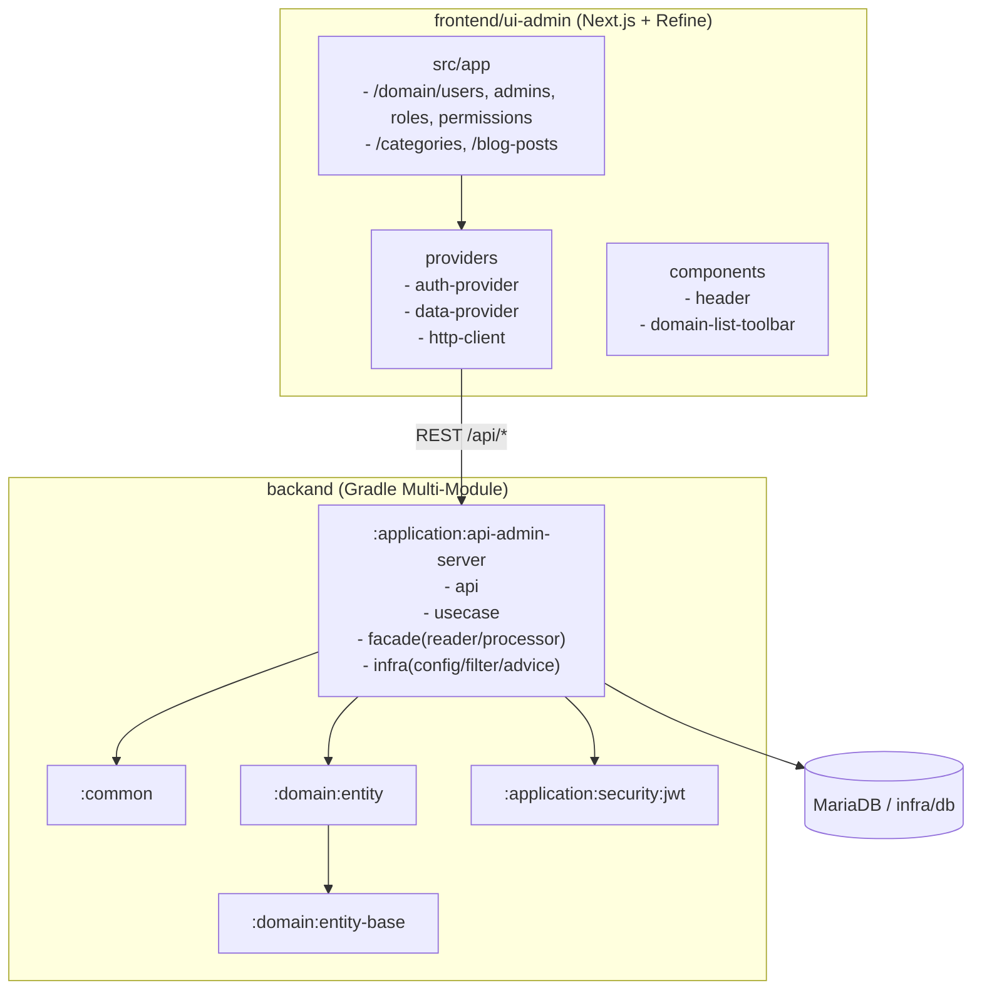
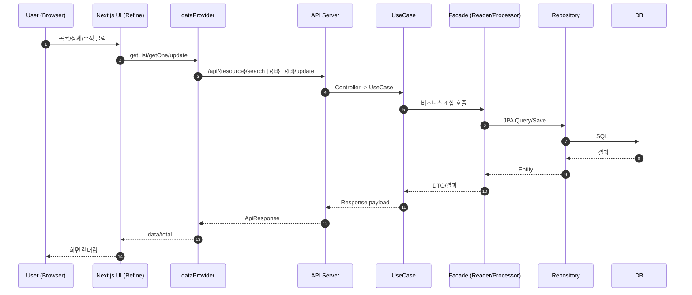
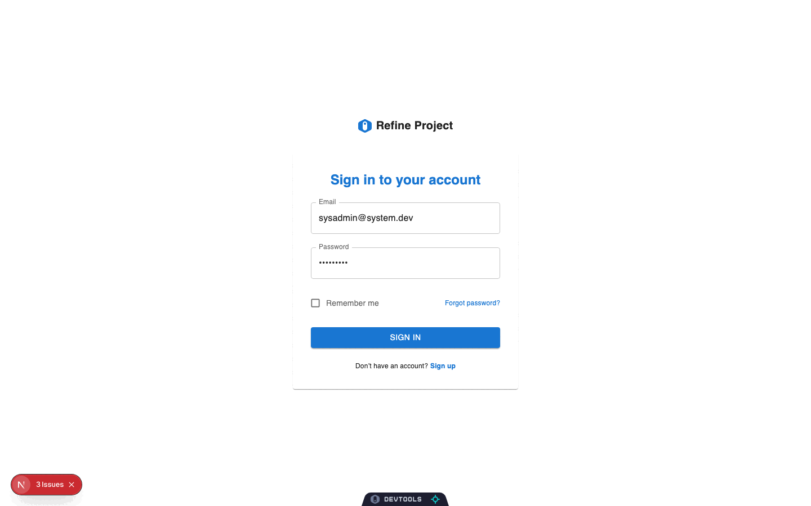

# Scaffolding Generic Web

## NOTE
- 아무리 생각해도 ADMIN PORTAL에서 CRUD 빠르게 / 공통적으로 찍어낼 방법이 떠오르지 않는다.
- 고전이기는 Generic CRUD Web 방식을 응용해서 작업 해보자.
- GITHUB 템플릿용

---
웹 어드민 / API-SERVER 프로젝트 모노레포입니다.
- `backand`: Spring Boot 멀티모듈 백엔드
- `frontend/ui-admin`: Next.js + Refine 기반 어드민 UI
- `infra/db`: 로컬 DB 도커 컴포즈
- `script`: 실행 보조 스크립트

## Project Structure

```text
.
├── backand
│   ├── common
│   ├── domain
│   │   ├── entity-base
│   │   └── entity
│   └── application
│       ├── application-facade
│       ├── security/jwt
│       ├── api-admin-server
│       └── api-service-server
├── frontend/ui-admin
├── infra/db
├── script
└── docs
```

## Backend Modules (Gradle)

`backand/settings.gradle.kts` 기준 모듈:

- `:common`
- `:domain:entity-base`
- `:domain:entity`
- `:application:application-facade`
- `:application:security:jwt`
- `:application:api-admin-server`
- `:application:api-service-server`

## JWT Filter Reuse

JWT 인증 필터는 공통 모듈에서 추상화되어 있습니다.

- 공통 추상 필터: `backand/application/security/jwt/src/main/java/com/revy/security/filter/AbstractJwtAuthenticationFilter.java`
- 서버 구현 필터 예시: `backand/application/api-admin-server/src/main/java/com/revy/api/admin/server/infra/filter/JwtAuthenticationFilter.java`

다른 프로젝트에서 재사용할 때:

1. `:application:security:jwt` 모듈 의존
2. `AbstractJwtAuthenticationFilter<T>` 상속 필터 생성
3. `resolvePrincipal`, `isActivePrincipal`, `toAuthentication` 구현
4. `SecurityConfig`에서 `addFilterBefore(..., UsernamePasswordAuthenticationFilter.class)` 등록

## Prerequisites

- Node.js 20+
- npm
- Docker / Docker Compose
- JDK 21

## Quick Start

### 통합 실행 스크립트

```bash
./script/all-start.sh
./script/all-start.sh local
./script/all-stop.sh
./script/all-restart.sh dev
```

- `all-start.sh [profile]`: infra(DB), backend(api-admin-server, api-service-server), frontend(ui-admin)를 한 번에 실행
- `all-stop.sh`: 통합 실행 스크립트로 띄운 backend, frontend, infra(DB)를 모두 종료
- `all-restart.sh [profile]`: backend, frontend, infra(DB) 전체 재시작
- `profile` 인자가 없으면 루트 `.env`의 `APP_PROFILE` 값을 사용하며, 없으면 `local`로 실행
- 로그 파일: `logs/*.log`
- PID 파일: `logs/pids/*.pid`

### 1) DB 실행

```bash
./script/run-infra.sh
```

또는:

```bash
docker compose -f ./infra/db/docker-compose.yml up -d
```

### 2) Backend 실행

```bash
cd backand
./gradlew :application:api-admin-server:bootRun
```

`api-service-server`를 실행하려면:

```bash
cd backand
./gradlew :application:api-service-server:bootRun
```

### 3) Frontend 실행

```bash
./script/run-front.sh
```

또는:

```bash
cd frontend/ui-admin
npm run dev
```

## URLs

- Frontend: `http://localhost:3000`
- Admin Swagger UI: `http://localhost:8080/swagger-ui/index.html`
- Service Swagger UI: `http://localhost:9090/swagger-ui/index.html`

## Springdoc (OpenAPI) Export

백엔드(`api-admin-server`, `api-service-server`) 실행 중 기준:

- Admin OpenAPI JSON: `http://localhost:8080/v3/api-docs`
- Service OpenAPI JSON: `http://localhost:9090/v3/api-docs`
- Admin OpenAPI YAML: `http://localhost:8080/v3/api-docs.yaml`
- Service OpenAPI YAML: `http://localhost:9090/v3/api-docs.yaml`
- Admin Swagger HTML: `docs/swagger-admin.html`
- Service Swagger HTML: `docs/swagger-service.html`

```bash
# docs HTML을 브라우저에서 열기 (프로젝트 루트 기준)
python3 -m http.server 18080
# http://localhost:18080/docs/swagger-admin.html
# http://localhost:18080/docs/swagger-service.html
```

```bash
# 프로젝트 루트 기준
curl -sS http://localhost:8080/v3/api-docs -o docs/openapi-admin.json
curl -sS http://localhost:9090/v3/api-docs -o docs/openapi-service.json
curl -sS http://localhost:8080/v3/api-docs.yaml -o docs/openapi-admin.yml
curl -sS http://localhost:9090/v3/api-docs.yaml -o docs/openapi-service.yml
```

## Backend Validation

```bash
cd backand
./gradlew :application:security:jwt:compileJava :application:api-admin-server:compileJava
```

## Frontend Validation

```bash
cd frontend/ui-admin
npm run build
npm run test:e2e
```

## AI Commit Message

전역 Git `prepare-commit-msg` 훅에서 이 프로젝트의 AI 커밋 메시지 스크립트를 호출하도록 구성할 수 있습니다.

### 1) 초기 설치

- 전역 hooks 경로: `~/.git/hooks`
- 전역 훅 파일: `~/.git/hooks/prepare-commit-msg`
- 프로젝트 스크립트: `script/generate-commit-message.mjs`
- 이 저장소 루트에는 별도 `package.json` 이 필요하지 않습니다.

### 2) Ollama 설정

쉘 환경변수 또는 루트 `.env`에 아래 값을 준비합니다.

```bash
export OLLAMA_HOST=http://127.0.0.1:11434
export OLLAMA_MODEL=llama3.2
```

- `OLLAMA_HOST`는 선택값이며, 없으면 `http://127.0.0.1:11434`를 사용합니다.
- `OLLAMA_MODEL`은 선택값이며, 없으면 `llama3.2`를 사용합니다.
- Ollama 호출이 실패하면 fallback 메시지를 생성합니다.

### 3) 사용

```bash
git add .
git commit
```

- 전역 `prepare-commit-msg` 훅이 현재 저장소 루트를 확인한 뒤 `script/generate-commit-message.mjs`를 호출합니다.
- staged diff 기준으로 AI가 커밋 메시지 1줄을 생성합니다.
- 로컬 Ollama를 호출해 `conventional commits` 형식(`type(scope): summary`)으로 생성합니다.
- `git commit -m "..."`처럼 직접 메시지를 넘기면 자동 생성은 건너뜁니다.

관련 파일:

- `script/generate-commit-message.mjs`
- `~/.git/hooks/prepare-commit-msg`

## Frontend Notes

- `npm run dev`는 `NEXT_PUBLIC_ENABLE_DEVTOOLS=true`로 실행됩니다.
- 개발 환경에서 허용할 origin은 `frontend/ui-admin/next.config.mjs`의 `allowedDevOrigins`를 사용합니다.
- 추가 origin이 필요하면 아래처럼 환경변수로 확장할 수 있습니다.

```bash
cd frontend/ui-admin
ALLOWED_DEV_ORIGINS=dev.mycorp.internal,10.0.0.12 npm run dev
```

## Grid Column Codegen

`ui-admin`에서는 JSON 모델로 `GridColDef[]` 초안을 생성할 수 있습니다.

```bash
cd frontend/ui-admin
cat model.json | npm run generate:grid-columns
```

상세 사용법은 `docs/HELP.md`를 참고하세요.

## Template Docs

`_dumy_domain` 복사 후 도메인 생성 가이드:

- `docs/HELP.md`

## Documentation

### front
- [Frontend 도메인 템플릿 가이드](docs/HELP.md)

### backend
- [Admin Swagger HTML](docs/swagger-admin.html)
- [Service Swagger HTML](docs/swagger-service.html)

## Architecture Diagrams
- [아키텍처 다이어그램 (PNG)](docs/architecture-overview.png)
- [아키텍처 다이어그램 원본 (Mermaid)](docs/architecture-overview.mmd)
- [요청 흐름 다이어그램 (PNG)](docs/request-flow.png)
- [요청 흐름 다이어그램 원본 (Mermaid)](docs/request-flow.mmd)


- 구조 다이어그램: `docs/architecture-overview.png`
- 요청 흐름 다이어그램: `docs/request-flow.png`
- 원본 Mermaid: `docs/architecture-overview.mmd`, `docs/request-flow.mmd`

### Architecture Overview




### Request Flow




## Notes

- 2뎁스 메뉴 그룹 리소스(`meta.parent`의 부모)는 `list` 경로를 넣지 않는 것을 권장합니다.
  - 부모에 `list`를 주면 링크 중첩으로 hydration 문제가 발생할 수 있습니다.

## Stop Infra

```bash
./script/stop-infra.sh
```

또는:

```bash
docker compose -f ./infra/db/docker-compose.yml down -v
```

## Frontend UI Admin Screenshots


